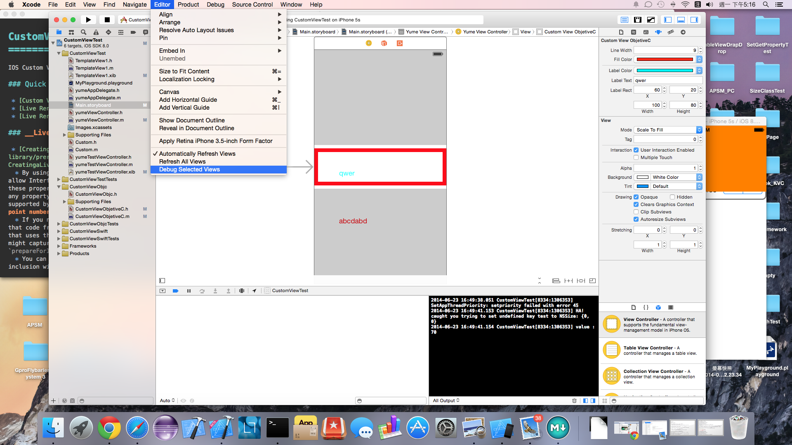
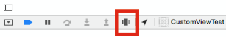
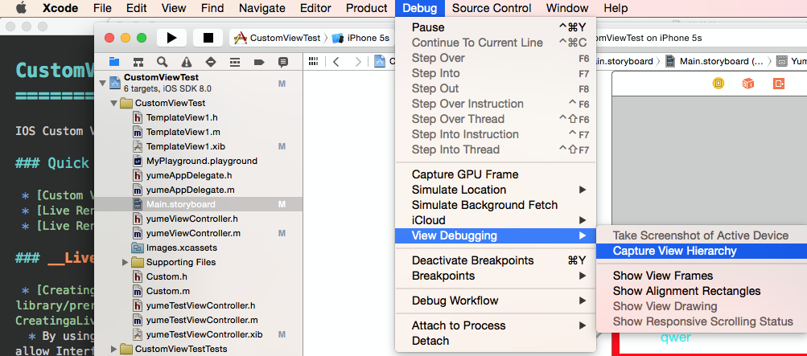

CustomView
==========

IOS Custom View with xib(IOS 7 &amp; 8) and Live Render (IOS 8)

 * [Custom View With xib (IOS 7 &amp; 8)](CustomView.md)
 * [Live Render (IOS 8)](LiveRender.md)
 * [Debug Selected Views](#debugSelectedViews)
 * [Debug View Hierarchy](#debugViewHierarchy)

## Combine custom view with xib, live render(IOS8) and KVC

### custom view with xib + live render

You must learn `custom view with xib` and `live render` first

then, add some code in your CustomView.m

we have some change at `setup` method

<pre><code>- (void) setup{
    NSString *nibName = NSStringFromClass([self class]);
    
    //Bundle Identifier can be find at Target -> Your Framework -> Bundle Identifier
    NSBundle *frameworkBundle = [NSBundle bundleWithIdentifier:@"com.yume190.CustomViewObjc"];
    
    UINib *nib = [UINib nibWithNibName:nibName bundle:frameworkBundle];
    
    [nib instantiateWithOwner:self options:nil];
    //Add the view loaded from the nib into self.
    [self addSubview:self.view];
}
</code></pre>

### custom view + KVC

Related Documents

 * [ViewSource.m](CustomViewObjc/ViewSource.m)
 * [CustomWithXibLiveRenderKVC.h](CustomViewObjc/CustomWithXibLiveRenderKVC.h)
 * [CustomWithXibLiveRenderKVC.m](CustomViewObjc/CustomWithXibLiveRenderKVC.m)
 * and storyboard

# Debug Selected Views

 * You must click target view and you can find this future below

|               | APP running          | Diff| `Debug Selected Views` (`Live Rendering`)  |Function|
| :------------ |:--------------------:|:---:|:-----------------------------------------------:|:------:|
|path           |`initWithCoder:` ┋ ┋ ┋ ┋ ⬇︎ `drawRect:`|≠   <   =|`initWithFrame:` ┋ ⬇︎ `prepareForInterfaceBuilder` ┋ ⬇︎ `drawRect:`|init method   Live Render 1   Live Render 2|

# Debug View Hierarchy

 * This future must running your APP, and you can find it at below.

or

